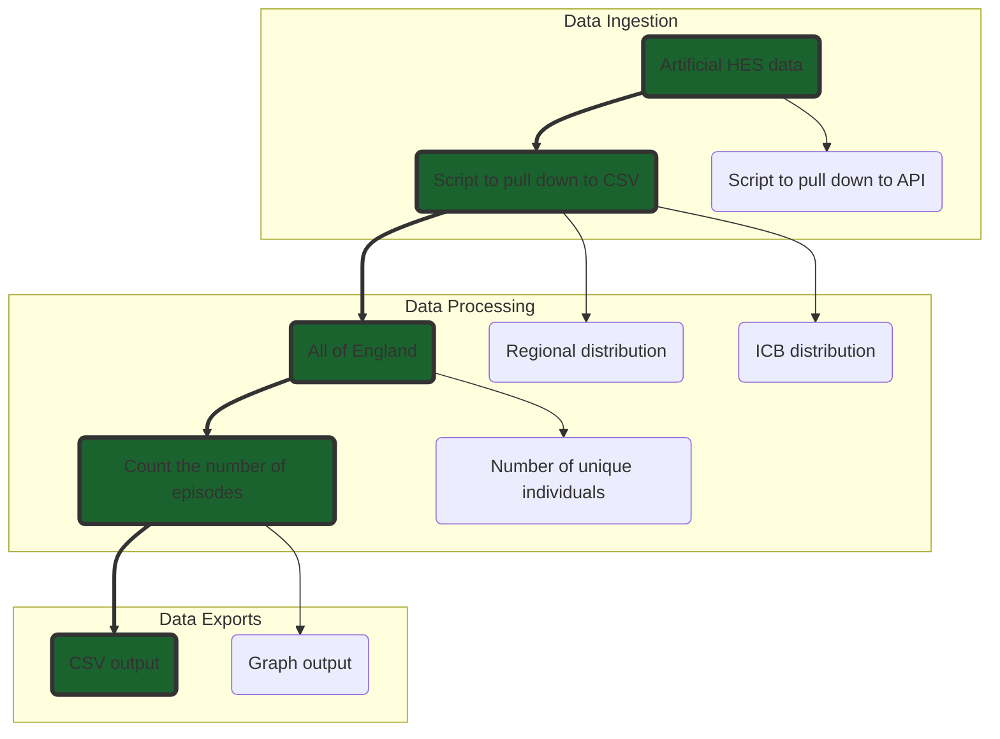

# RAP Example Pipeline - using R

:exclamation: Warning: this repository may contain references internal to NHS England that cannot be accessed publicly

This repo contains a simple example pipeline to act as an example of RAP good-practice with R.

## Description

[Reproducible Analytical Pipelines](https://nhsdigital.github.io/rap-community-of-practice/) can seem quite abstract - so this repo is meant to serve as a real example, that anyone can run, to see RAP in action with R.

The pipeline uses artificial HES data, which was chosen as it is "like" real data used in our industry, but also freely available. 

The pipeline follows three steps which are common to almost all analytical pipelines:

1. Getting the data - in this case we download the artificial HES data as a CSV which is saved into folder called 'data_in' on your machine (see the code in src/data_ingestion)
2. Processing the data - the data is aggregated using R (the code for this is in src/data_processing)
3. Saving the processed data - the processed data is saved as a csv in a folder called 'data_out' (see the code in src/data_exports)

## Prerequisites

This code requires R version 4.3.2 (2023-10-31, nickname: Eye Holes), the R Project website has [instructions for downloading and installing R](https://www.r-project.org/).

## Getting Started

1. Clone the repository. To learn about what this means, and how to use Git, see the [Git guide](https://nhsdigital.github.io/rap-community-of-practice/training_resources/git/using-git-collaboratively/).

```
git clone https://github.com/nhsengland/RAP_example_pipeline_r.git
```

2. Make sure you have renv installed. From the R console:

`install.packages("renv")`

3. Install dependencies:

`renv::restore()`

## Running the pipeline

To run the pipeline, run the create_report.r file, either by running that file in your IDE (RStudio, VS Code etc.) or from the command line with the following line, making sure you are in the root folder of the project:

`Rscript create_report.r`


## Project structure

```text
|   .gitignore                        <- Files (& file types) automatically removed from version control
|   .RProfile                         <- R Profile file
|   create_report.r                   <- Runs the overall pipeline to produce the publication
|   LICENCE                           <- Licence info for public distribution
|   README.md                         <- Quick start guide / explanation of the project. The file you're reading now (and thank you for reading it!)
|   renv.lock                         <- lockfile for the renv package manager. Contains a list of all the packages the project needs.
|
+---.devcontainer
|   |       devcontainer.json         <- If you use GitHub Codespaces, this file will launch an unbuntu machine with RStudio pre-installed. Otherwise you can ignore this.
|   |
+---data_in                           <- Data downloaded from external sources can be saved here. Files in here will not be committed
|   |       .gitkeep                  <- This is a placeholder file that enables the otherwise empty directory to be committed
|   |
+---data_out                          <- Any data saved as files will be stored here. Files in here will not be committed
|   |       .gitkeep                  <- This is a placeholder file that enables the otherwise empty directory to be committed
|   |
+---renv                              <- Files used by renv, the dependency management package.
|   |
|   +---library                       <- renv will install the packages needed by the process here
|   |       .gitignore                <- Auto generated by renv. Prevents packages from being committed to your git repository
|   |       activate.R                <- Auto generated by renv to activate its package management features. Should not be edited
|   |       settings.json             <- Auto generated by renv. Advanced users can adjust renv settings here
|   |
+---src                               <- Scripts with functions for use in 'create_publication.r'. Contains the project's codebase
|   |
|   +---data_exports
|   |       .gitkeep                  <- This is a placeholder file that enables the otherwise empty directory to be committed
|   |
|   +---data_ingestion                <- functions to import and preprocess data
|   |       .gitkeep                  <- This is a placeholder file that enables the otherwise empty directory to be committed
|   |       import_data.r             <- Gets data from external sources
|   |
|   +---data_processing               <- functions to process data i.e. clean and derive new fields, create aggregations etc.
|   |       .gitkeep                  <- This is a placeholder file that enables the otherwise empty directory to be committed
|   |       aggregations.r            <- Functions that create the aggregate counts needed in the outputs
|   | 
|   +---utils                         <- utility functions not captured by the folder above
|   |       .gitkeep                  <- This is a placeholder file that enables the otherwise empty directory to be committed
```

### `root`

In the highest level of this repository (known as the 'root'), the key file is: `create_report.r` (see above for more info). The `create_report.r` file is where people will go to actually run the pipeline.

### `src`

This directory contains the meaty parts of the code. By organising the code into logical sections, we make it easier to understand, maintain and test. Moreover, tucking the complex code out of the way means that users don't need to understand everything about the code all at once.

### `tests`

This folder contains the tests for the code base. It's good practice to have unit tests for your functions at the very least, ideally in addition to tests of the pipeline as a whole such as backtests.

## Process Map

If you have one, it can be useful to include a visual representation of your process. You can make flow charts with tools like Mural, Whiteboard, draw.io, etc. The one below was made using the mermaid markdown feature, which enables you to make flowcharts with code:



The process map shows three key stages - data ingestion, data processing, and data exports. Almost all analytical processes will follow these three broad steps.

The three blocks in the diagram also correspond to the subfolders in /src. So the data ingestion functions will live in src/data_ingestion/, the processing code lives in src/data_processing/, and so on.

In this diagram you'll also note that there is an end-to-end thread highlighted in green. In RAP we call this a "thin-slice". When developing a pipeline, we've found it useful to start by aiming for a thin slice, that goes end-to-end in your process, and produces some output, even if that's only one statistic.

Learn more here:

* [Process mapping](https://nhsdigital.github.io/rap-community-of-practice/implementing_RAP/process_mapping/)
* [The thin-slice approach](https://nhsdigital.github.io/rap-community-of-practice/our_RAP_service/thin-slice-strategy/)


## Licence

This codebase is released under the MIT License. This covers both the codebase and any sample code in the documentation.

Any HTML or Markdown documentation is [© Crown copyright](https://www.nationalarchives.gov.uk/information-management/re-using-public-sector-information/uk-government-licensing-framework/crown-copyright/) and available under the terms of the [Open Government 3.0 licence](https://www.nationalarchives.gov.uk/doc/open-government-licence/version/3/).


## Contact

**This repository is maintained by the NHS England Data Science Team**.
> _To contact us raise an issue on Github or via [email](mailto:england.rapchampions@nhs.net)._
> 
> See our (and our colleagues') other work here: [NHS England Analytical Services](https://github.com/NHSDigital/data-analytics-services)

-----------

## Acknowledgements
- [The RAP team](https://github.com/NHSDigital/rap-community-of-practice)!